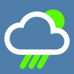
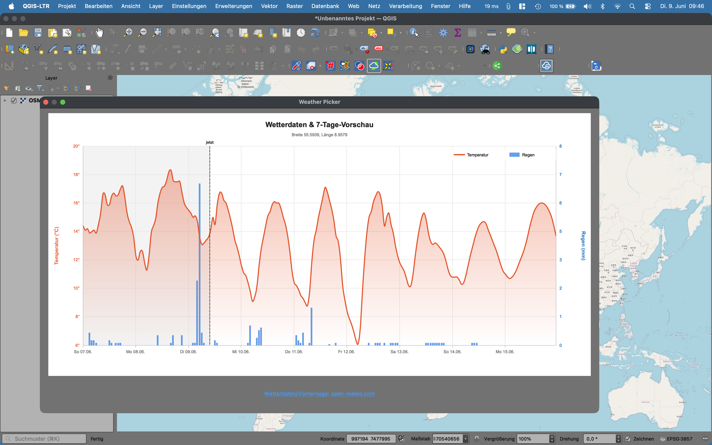
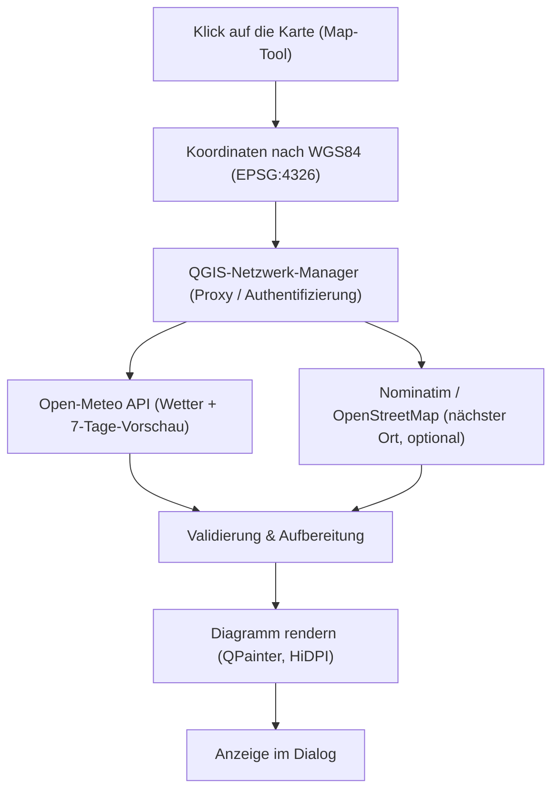

<div align="center">



<p>
  
</p>

<h1>Weather Picker — QGIS-Plugin</h1>

<p>
<strong>Auf die Karte klicken → Wetterdaten inkl. 7-Tage-Vorschau als Diagramm.</strong><br />
<strong>Click the map → weather data incl. 7-day forecast as a chart.</strong>
</p>

[](https://qgis.org)
[](metadata.txt)
[](LICENSE)
[](https://open-meteo.com)
[](https://creativecommons.org/licenses/by/4.0/)
[](#konfiguration)

<br />



<p><a href="#deutsch">Deutsch</a> | <a href="#english">English</a></p>

</div>

---

<a name="deutsch"></a>
## Deutsch

Einfache Wetterauskunft inklusive 7-Tage-Vorschau für die angeklickte Koordinate.
Temperatur- und Regenverlauf werden als pixelscharfes Diagramm dargestellt, ergänzt
um den nächstgelegenen Ort. Die Wetterdaten stammen von der
[Open-Meteo-API](https://open-meteo.com), die Ortsnamen von
[OpenStreetMap](https://www.openstreetmap.org/copyright). Die Oberfläche folgt
automatisch der QGIS-Sprache (Deutsch/Englisch).

### Inhaltsverzeichnis

- [Funktionen](#funktionen)
- [Tech-Stack](#tech-stack)
- [Projektstruktur](#projektstruktur)
- [Architektur](#architektur)
- [Installation](#installation)
- [Verwendung](#verwendung)
- [Konfiguration](#konfiguration)
- [Datenschutz](#datenschutz)
- [Mitwirken](#mitwirken)
- [Lizenz & Daten](#lizenz--daten)

### Funktionen

- Geglättete Temperaturkurve und Regenmengen in einem Diagramm
- Nächster Ort zur Koordinate — „in der Nähe von …" im Diagramm, ermittelt über [Nominatim](https://nominatim.openstreetmap.org/) (OpenStreetMap)
- „Jetzt"-Markierung und dezent schattierte Vergangenheit
- Zweisprachig DE/EN — folgt automatisch der QGIS-Oberflächensprache
- Locale-korrekte Datums- und Zahlenformate (Wochentag/Reihenfolge aus `QLocale`, Dezimaltrenner nach Sprache)
- Netzwerkabruf über den QGIS-Netzwerk-Manager — respektiert Proxy/Authentifizierung (z. B. NTLM/Kerberos im Firmennetz)
- Scharfes HiDPI-Rendering (`devicePixelRatio`)

### Tech-Stack

| Bereich | Technologie |
|---|---|
| Sprache | Python 3 |
| Plattform | QGIS 3.16+ (Qt5/Qt6-kompatibel) |
| GUI & Grafik | PyQt (`QPainter`, `QImage`) |
| Netzwerk | QGIS-Netzwerk-Manager (`QgsBlockingNetworkRequest`) |
| Wetterdaten | [Open-Meteo](https://open-meteo.com) (REST/JSON) |
| Geocoding | [Nominatim](https://nominatim.openstreetmap.org/) / OpenStreetMap |
| Lokalisierung | `QLocale` + interne DE/EN-Tabelle (kein Build-Tooling) |

### Projektstruktur

```text
.
├── weather_picker.py   # Plugin- & Map-Tool-Logik, Diagramm-Rendering, i18n
├── __init__.py         # classFactory – Einstiegspunkt für QGIS
├── metadata.txt        # Plugin-Metadaten nach QGIS-Spezifikation
├── logo.png            # Plugin-Icon / Toolbar-Symbol
├── LICENSE             # GNU GPL v2
└── README.md
```

### Architektur

Der Datenfluss vom Kartenklick bis zum Diagramm. Beide Netzabrufe laufen bewusst
über den QGIS-Netzwerk-Manager, damit Proxy- und Authentifizierungseinstellungen
greifen. Das Reverse-Geocoding ist optional: Schlägt es fehl, zeigt das Diagramm
nur die Koordinaten.



### Installation

Aus dem QGIS-Plugin-Manager (sobald veröffentlicht): *Erweiterungen → Erweiterungen verwalten und installieren → nach „Weather Picker" suchen*.

Manuell aus ZIP: *Erweiterungen → Aus ZIP installieren* und die Plugin-ZIP wählen.

Aus dem Quellcode — Ordner in das QGIS-Plugin-Verzeichnis kopieren und QGIS neu starten:

```bash
# Windows
%APPDATA%\QGIS\QGIS3\profiles\default\python\plugins\

# Linux
~/.local/share/QGIS/QGIS3/profiles/default/python/plugins/

# macOS
~/Library/Application Support/QGIS/QGIS3/profiles/default/python/plugins/
```

### Verwendung

1. In der Werkzeugleiste **geoObserverTools** auf das **Weather Picker**-Symbol klicken (Werkzeug aktiviert sich, Symbol bleibt eingedrückt).
2. Auf eine beliebige Stelle der **Karte klicken**.
3. Das Diagramm mit Temperatur- und Regenverlauf öffnet sich; unten der Quellen-/Lizenzhinweis.
4. Erneuter Klick auf das Symbol **deaktiviert** das Werkzeug wieder.

> [!NOTE]
> Das angeklickte Koordinatensystem ist beliebig — das Plugin transformiert intern nach WGS84 (EPSG:4326).

### Konfiguration

Das Plugin hat **keine eigenen Einstellungen**; das Verhalten wird über QGIS gesteuert:

| Aspekt | Steuerung |
|---|---|
| Sprache (DE/EN) | *Einstellungen → Optionen → Allgemein → Benutzeroberfläche* (System-Locale überschreiben). Deutsch → DE, sonst EN. |
| Datum/Zahlen | Folgen der Sprache bzw. dem Regions-Locale (z. B. `en_US` → `06/09`, `en_GB` → `09/06`). |
| Proxy / Authentifizierung | *Einstellungen → Optionen → Netzwerk*. |
| Endpoint / API-Key | Fester, kostenloser Open-Meteo-Endpoint — **kein API-Key nötig**. |
| Timeout | Fest 15 Sekunden (Wetter) bzw. 8 Sekunden (Ortsname); danach sauberer Abbruch. |
| Cache | Wetter bewusst ohne Cache (`forceRefresh`); Ortsnamen werden pro Position (~100 m) lokal zwischengespeichert. |

### Datenschutz

Beim Klick werden die **Koordinaten** der angeklickten Position (zusammen mit Ihrer
**IP-Adresse**) an Open-Meteo übertragen. Laut Open-Meteo können Server-Logs solche
Daten zeitweise enthalten — siehe die [Open-Meteo-Nutzungsbedingungen](https://open-meteo.com/en/terms).
Für den **nächsten Ort** werden dieselben Koordinaten zusätzlich an
[Nominatim/OpenStreetMap](https://operations.osmfoundation.org/policies/nominatim/)
gesendet (Reverse-Geocoding). Ergebnisse werden pro Position lokal zwischengespeichert,
um die Anzahl der Anfragen gering zu halten. Das Plugin selbst schreibt Koordinaten
**nur gerundet (~1 km)** ins QGIS-Log.

### Mitwirken

Beiträge sind willkommen. Für Bugs oder Feature-Wünsche bitte ein
[Issue](https://github.com/geoObserver/WeatherPicker/issues) öffnen, für
Code-Änderungen einen Pull Request.

### Lizenz & Daten

- **Code:** [GNU General Public License v2](LICENSE)
- **Wetterdaten:** © [Open-Meteo](https://open-meteo.com), Lizenz [CC BY 4.0](https://creativecommons.org/licenses/by/4.0/)
- **Ortsnamen:** © [OpenStreetMap-Mitwirkende](https://www.openstreetmap.org/copyright), Reverse-Geocoding via [Nominatim](https://nominatim.openstreetmap.org/) (Daten unter ODbL)
- Der **kostenlose** Open-Meteo-Endpoint ist für die **nichtkommerzielle** Nutzung vorgesehen. Für kommerzielle Nutzung bitte die Open-Meteo-Bedingungen beachten.
- Die **öffentliche Nominatim-Instanz** ist für moderate Nutzung gedacht (max. 1 Anfrage/Sekunde) — siehe die [Nominatim-Nutzungsrichtlinie](https://operations.osmfoundation.org/policies/nominatim/).

<p align="right">(<a href="#deutsch">nach oben</a>)</p>

---

<a name="english"></a>
## English

Simple weather information including a 7-day forecast for the clicked location.
Temperature and rainfall are rendered as a pixel-sharp chart, enriched with the
nearest place. Weather data is provided by the [Open-Meteo API](https://open-meteo.com),
place names by [OpenStreetMap](https://www.openstreetmap.org/copyright). The interface
follows the QGIS UI language automatically (German/English).

### Table of Contents

- [Features](#features)
- [Tech Stack](#tech-stack-1)
- [Project Structure](#project-structure)
- [Architecture](#architecture)
- [Installation](#installation-1)
- [Usage](#usage)
- [Configuration](#configuration)
- [Privacy](#privacy)
- [Contributing](#contributing)
- [License & Data](#license--data)

### Features

- Smoothed temperature curve and rainfall in one chart
- Nearest place for the coordinate — "near …" in the chart, resolved via [Nominatim](https://nominatim.openstreetmap.org/) (OpenStreetMap)
- "now" marker and subtly shaded past
- Bilingual DE/EN — follows the QGIS UI language automatically
- Locale-correct date and number formats (weekday/order from `QLocale`, decimal separator by language)
- Network access via the QGIS network manager — honours proxy/authentication (e.g. NTLM/Kerberos on corporate networks)
- Sharp HiDPI rendering (`devicePixelRatio`)

### Tech Stack

| Area | Technology |
|---|---|
| Language | Python 3 |
| Platform | QGIS 3.16+ (Qt5/Qt6-compatible) |
| GUI & graphics | PyQt (`QPainter`, `QImage`) |
| Network | QGIS network manager (`QgsBlockingNetworkRequest`) |
| Weather data | [Open-Meteo](https://open-meteo.com) (REST/JSON) |
| Geocoding | [Nominatim](https://nominatim.openstreetmap.org/) / OpenStreetMap |
| Localization | `QLocale` + internal DE/EN table (no build tooling) |

### Project Structure

```text
.
├── weather_picker.py   # Plugin- & Map-Tool-Logik, Diagramm-Rendering, i18n
├── __init__.py         # classFactory – Einstiegspunkt für QGIS
├── metadata.txt        # Plugin-Metadaten nach QGIS-Spezifikation
├── logo.png            # Plugin-Icon / Toolbar-Symbol
├── LICENSE             # GNU GPL v2
└── README.md
```

### Architecture

Data flow from the map click to the chart. Both network calls deliberately go
through the QGIS network manager so that proxy and authentication settings apply.
Reverse geocoding is optional: if it fails, the chart shows the coordinates only.


### Installation

From the QGIS Plugin Manager (once published): *Plugins → Manage and Install Plugins → search for "Weather Picker"*.

Manually from ZIP: *Plugins → Install from ZIP* and pick the plugin ZIP.

From source — copy the folder into the QGIS plugins directory and restart QGIS:

```bash
# Windows
%APPDATA%\QGIS\QGIS3\profiles\default\python\plugins\

# Linux
~/.local/share/QGIS/QGIS3/profiles/default/python/plugins/

# macOS
~/Library/Application Support/QGIS/QGIS3/profiles/default/python/plugins/
```

### Usage

1. In the **geoObserverTools** toolbar, click the **Weather Picker** icon (the tool activates, icon stays pressed).
2. **Click anywhere on the map.**
3. A chart with the temperature and rainfall trend opens; the source/license note is shown at the bottom.
4. Click the icon again to **deactivate** the tool.

> [!NOTE]
> Any project CRS works — the plugin transforms internally to WGS84 (EPSG:4326).

### Configuration

The plugin has **no settings of its own**; behaviour is driven by QGIS:

| Aspect | Controlled via |
|---|---|
| Language (DE/EN) | *Settings → Options → General → User interface* (override system locale). German → DE, otherwise EN. |
| Date/Numbers | Follow the language / regional locale (e.g. `en_US` → `06/09`, `en_GB` → `09/06`). |
| Proxy / authentication | *Settings → Options → Network*. |
| Endpoint / API key | Fixed free Open-Meteo endpoint — **no API key required**. |
| Timeout | Fixed 15 seconds (weather) and 8 seconds (place name); then a clean abort. |
| Cache | Weather is fetched uncached (`forceRefresh`); place names are cached locally per location (~100 m). |

### Privacy

On click, the **coordinates** of the clicked location (together with your **IP address**)
are sent to Open-Meteo. Per Open-Meteo, server logs may temporarily contain such data —
see the [Open-Meteo terms](https://open-meteo.com/en/terms). For the **nearest place**, the
same coordinates are additionally sent to
[Nominatim/OpenStreetMap](https://operations.osmfoundation.org/policies/nominatim/)
(reverse geocoding). Results are cached locally per location to keep the request count low.
The plugin itself only logs **rounded coordinates (~1 km)** to the QGIS log.

### Contributing

Contributions are welcome. Open an
[issue](https://github.com/geoObserver/WeatherPicker/issues) for bugs or feature
requests, and a pull request for code changes.

### License & Data

- **Code:** [GNU General Public License v2](LICENSE)
- **Weather data:** © [Open-Meteo](https://open-meteo.com), licensed under [CC BY 4.0](https://creativecommons.org/licenses/by/4.0/)
- **Place names:** © [OpenStreetMap contributors](https://www.openstreetmap.org/copyright), reverse geocoding via [Nominatim](https://nominatim.openstreetmap.org/) (data under ODbL)
- The **free** Open-Meteo endpoint is intended for **non-commercial** use. For commercial use, please review the Open-Meteo terms.
- The **public Nominatim instance** is meant for moderate use (max. 1 request/second) — see the [Nominatim usage policy](https://operations.osmfoundation.org/policies/nominatim/).

<p align="right">(<a href="#english">back to top</a>)</p>

---

<div align="center">

**Autor / Author:** Mike Elstermann ([#geoObserver](https://geoobserver.de/)) ·
**Issues:** [github.com/geoObserver/WeatherPicker/issues](https://github.com/geoObserver/WeatherPicker/issues)

</div>
